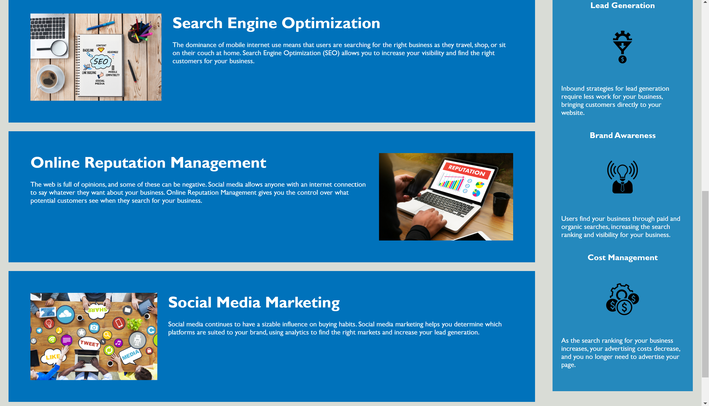

# HORISEON

### DESCRIPTION 

* Horiseon is a marketing firm that specializes online brand managment, lead generation, and search engine optimization.

### GOALS

* Webpage meets accessibility standards
* HTML has semantic elements
* HTML elements follow a logical structure of styling and position
* Alt attributes are present in image elements
* Heading attribute fall in sequential order
* Title element is consice and descriptive

### LINKS

* https://kahler197.github.io/Horiseon-Landing-Page/
* https://github.com/kahler197/Horiseon-Landing-Page.git